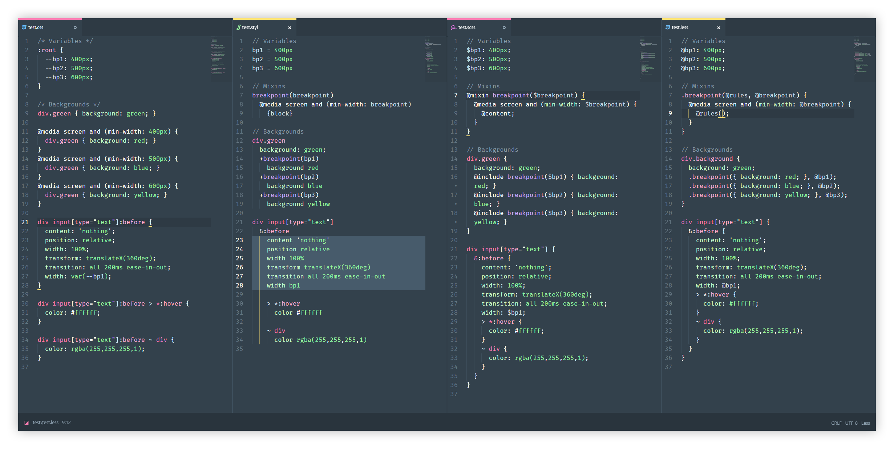
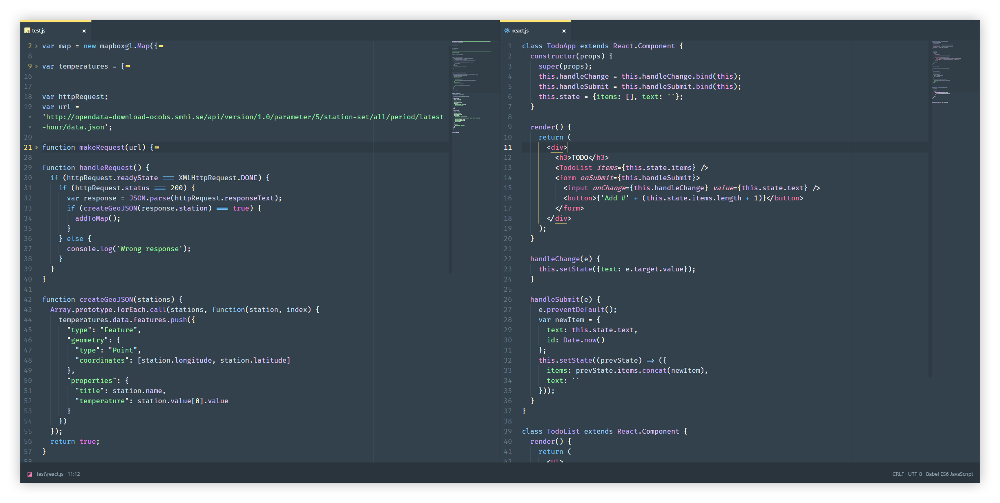
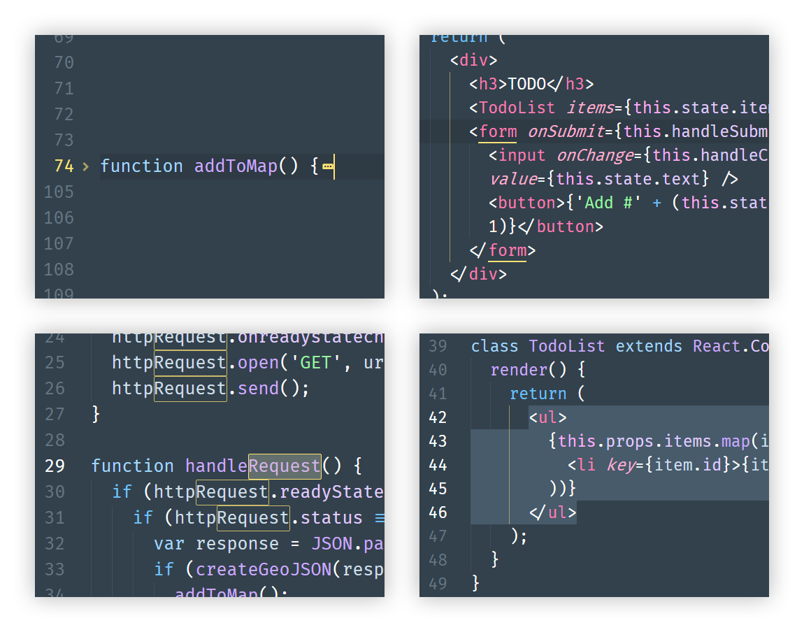

# Friendly syntax theme for Atom

Dark blueish syntax theme with soft colors for atom that's keen on the eye but stull colorful. It looks at it's best together with the [Friendly UI](http://github.com/primalivet/friendly-ui).

Friendly syntax together with the matching [Friendly UI](https://github.com/primalivet/friendly-ui). The font used in the screenshot is [Fira Code](https://github.com/tonsky/FiraCode).

## More screenshots

## Details

Screens are showing code folding, bracket matcher, find and replace and selection.

## Installation

**APM:** apm install friendly-syntax

**Preferences:** Go to Preferences > Install and choose Themes
Search for `friendly-syntax` and install it
Go to Preferences > Themes and choose Friendly as the syntax theme.
